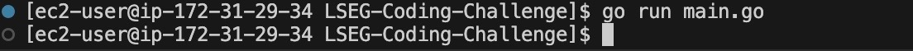

# LSEG-Coding-Challenge
Coding challenge for LSEG shortlist

## Prompt 

```
We need you to write code that will query the metadata of an instance within AWS and provide a Json
formatted output. The choice of language and implementation is up to you.

Bonus Points: The code allows for a particular data key to be retrieved individually
```


## Solution was ran inside EC2 instance on AWS and written out to [file](output.json) 



Docs used: 
- https://docs.aws.amazon.com/AWSEC2/latest/UserGuide/configuring-instance-metadata-service.html
- https://docs.aws.amazon.com/AWSEC2/latest/UserGuide/ec2-instance-metadata.html#instancedata-data-categories

